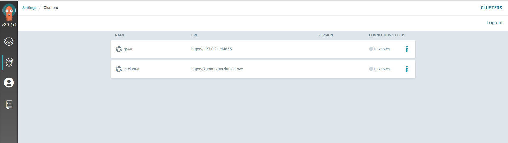

# Step 1 Setup ArgoCD value file for First Cluster
```
bash scripts/setup_argocd.sh 
```
# Step 2 Install ArgoCD at First cluster 
```
bash scripts/install_argocd.sh 
```

# Step 3 Setup the Service Account at second/leaf for clusters (repeat for every cluster wants to controlled by Argocd)
```
bash scripts/setup_cluster.sh 

```
# Step 4 Add the cluster to argocd 
```
bash scripts/add_cluster_to_argocd.sh

```

# Clean up  
