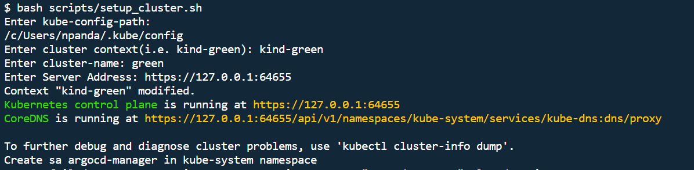

# Install argocd in cluster 

#### FOR THE VERY FIRST TIME 
```
bash install_argocd.sh generate <dc-name>
```

####  Fix the value file or existing value file use this command 
```
bash install_argocd.sh template <dc-name>
```


# Setup the target clusters
```
setup_cluster.sh

```

# Add the cluster to argocd 
```
bash add_cluster_to_argocd.sh

```
