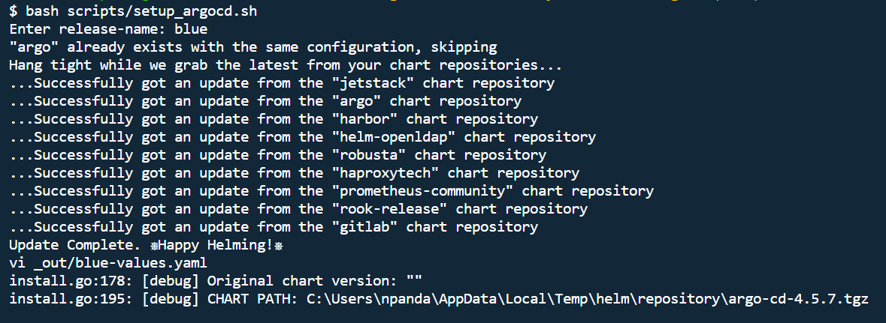
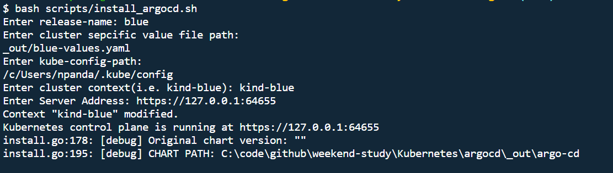
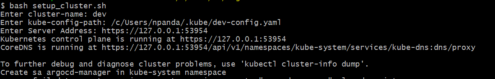
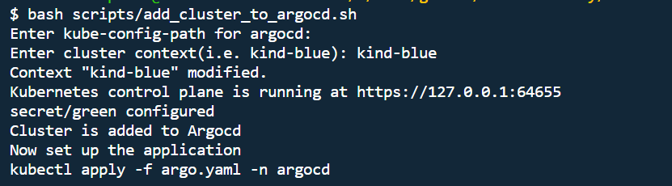

# Install cluster 1 
```

kind create cluster --config=blue-kind-config.yaml
kind create cluster --config=green-kind-config.yaml

```
# install helm
```
curl -fsSL -o get_helm.sh https://raw.githubusercontent.com/helm/helm/main/scripts/get-helm-3
chmod 700 get_helm.sh
./get_helm.sh
helm_version=$(helm version --short)
echo "Helm installed version: ${helm_version} "
```

# Setup ArgoCD value file for First Cluster
```
#kubectl cluster-info --context kind-blue
bash ../scripts/setup_argocd.sh 
```


####  Install ArgoCD at First cluster 
```
#kubectl cluster-info --context kind-blue
bash ../scripts/install_argocd.sh 
```


# Setup the Service Account at second/leaf for clusters (repeat for every cluster wants to controlled by Argocd)
```
#kubectl cluster-info --context kind-green
bash ../scripts/setup_cluster.sh 

```



# Add the cluster to argocd 
```
#kubectl cluster-info --context kind-blue
bash ../scripts/add_cluster_to_argocd.sh

```
