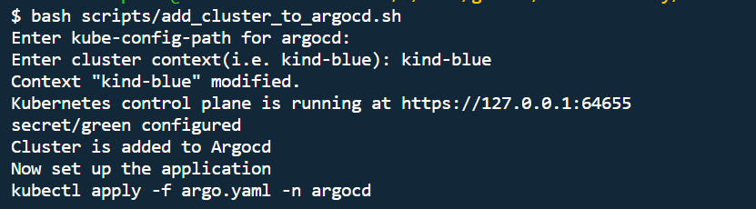
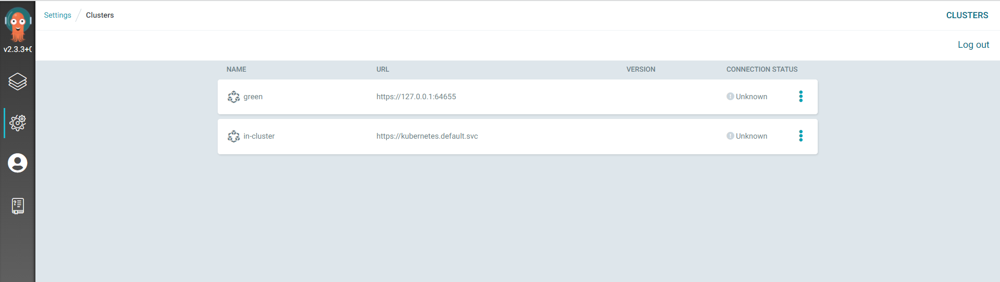

# Setup ArgoCD value file for First Cluster
```
bash ../scripts/setup_argocd.sh 
```


####  Install ArgoCD at First cluster 
```
bash ../scripts/install_argocd.sh 
```


# Setup the Service Account at second/leaf for clusters (repeat for every cluster wants to controlled by Argocd)
```
bash ../scripts/setup_cluster.sh 

```


# Add the cluster to argocd 
```
#kubectl cluster-info --context kind-blue
bash ../scripts/add_cluster_to_argocd.sh
```


# Check the Green cluster 


# Clean up  
